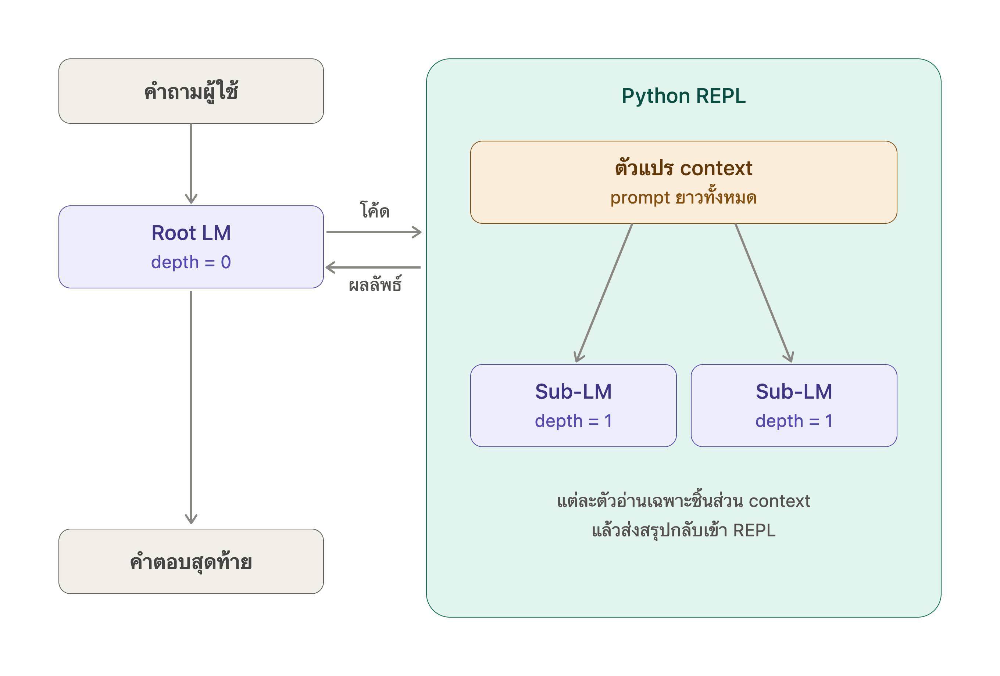

# monty-claw

A serverless, OpenClaw-style personal AI assistant. The agent runtime is
Pydantic AI in [code mode](https://github.com/pydantic/monty#pydanticai-integration):
one chat turn is one `Agent.run`, where the model writes Python that Pydantic
AI executes in a [pydantic-monty](https://github.com/pydantic/monty) sandbox
and dispatches the tool calls made from inside it — recursion in the spirit of
[arXiv:2512.24601](docs/researchs/2512.24601-recursive-language-models.md),
with `llm_query` fanning sub-model calls out from the sandbox. The sandbox
REPL lives for one turn; the assistant's memory across turns is the message
history, kept in GCS (or a local directory) while MongoDB holds the structured
chat state. The whole thing runs scale-to-zero on Cloud Run behind a Telegram
webhook.



```
Telegram ──webhook──▶ FastAPI (Cloud Run)
                        │  load message history (GCS) + chat record (MongoDB)
                        ▼
                  Agent.run with CodeMode: model ⇄ run_code (Monty)
                        │  llm_query / send_message tools, called from code
                        ▼
                  persist history ──▶ reply via Bot API
```

## Agent tools

Called from inside `run_code`, so the model can loop over them or fan them out
with `asyncio.gather`:

| Tool | What it does |
|---|---|
| `llm_query(prompt)` | Ask a sub-model a self-contained question |
| `send_message(text)` | Interim note to the user mid-turn |
| `generate_image(prompt, width, height)` | Store a mock-up image and return its URL |

`generate_image` is a placeholder, not an image model: it renders the prompt
onto a hash-derived background (PNG, via Pillow), stores it under
`media/<chat>/<uuid>.png` in blob storage, and returns a URL served by the app
at `/media/...` — no bucket ACLs needed, and the random key is what keeps it
private. On Telegram the picture is also uploaded straight into the chat with
`sendPhoto`, so it appears inline. Set `PUBLIC_BASE_URL` so the URLs are
absolute and openable outside the web UI.

## Quick start

```bash
uv sync
uv run pytest                 # unit tests (no network needed)
uv run monty-claw repl        # terminal chat; needs an OpenAI-compatible LLM
```

The default LLM config targets local Ollama (`minimax-m3:cloud` at
`http://localhost:11434/v1`); override with `LLM_BASE_URL`, `LLM_MODEL`,
`LLM_API_KEY`.

## Commands

| Command | Purpose |
|---|---|
| `monty-claw repl` | Terminal chat against the full engine (local storage, no Telegram/Mongo) |
| `monty-claw poll` | Local dev against real Telegram via `getUpdates` (no public URL) |
| `monty-claw serve` | FastAPI webhook server — the Cloud Run entrypoint |
| `monty-claw set-webhook --url …` | Point the Telegram webhook at a deployment |

In chat, `/reset` wipes the assistant's memory for that chat.

## Web UI

`monty-claw serve` also hosts a web frontend at `/` with a chat tab and a
configuration tab (LLM endpoint/model/key and engine knobs, persisted to
MongoDB and applied live). It's protected by username/password login
(signed-cookie sessions, so they survive scale-to-zero) and disabled unless
both `WEB_USERNAME` and `WEB_PASSWORD` are set.

## Layout

- `src/monty_claw/rlm/` — the agent engine, instructions, model factory
- `src/monty_claw/db/` — MongoDB chat records (transcript, dedupe, blob pointer)
- `src/monty_claw/storage/` — blob storage for message history (GCS / local)
- `src/monty_claw/channels/` — channel adapters (Telegram; Line/Slack later)
- `src/monty_claw/web/` — login-protected web frontend (chat + configuration)
- `snippets/` — standalone pydantic-monty examples
- `docs/deploy.md` — Cloud Run deployment guide
